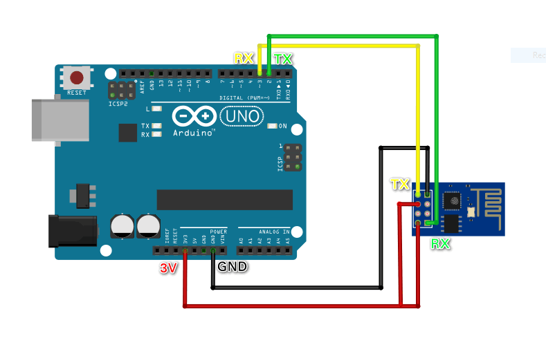

# TridentTD_Blynk_ESP01
ESP8266 library for Blynk with ESP-01 module



การต่อ Blynk แบบ ใช้ โมดูล ESP-01 ร่วมกับ Arduino UNO/MEGA  
ในบางครั้งการเมื่อ WiFi ไม่สามารถเชื่อมต่อได้  
จะทำให้ไม่สามารถควบคุมสิ่งอื่นๆ ที่ต่อพ่วง Arduino UNO/MEGA ต่อได้  

ไลบรารี้ได้เสริมให้สามารถทำงานอย่างอื่นบน Arduino UNO/MEGA ได้ด้วย  
แม้ WiFi จะยังไม่สามารถเชื่อมต่อได้  

## Example 1
### ตัวอย่างสำหรับทดสอบการเชื่อมต่อ WiFi และ Blynk

```cpp
#define BLYNK_PRINT Serial

#include <BlynkSimpleShieldEsp8266.h>
#include <SoftwareSerial.h>

SoftwareSerial EspSerial(3, 2); // RX, TX
ESP8266 WiFi(&EspSerial);

char auth[] = "----------------------";
char ssid[] = "----------------------";
char pass[] = "----------------------";

void setup() {
  Serial.begin(9600);
  EspSerial.begin(115200);

  WiFi.begin(ssid, pass);
  Blynk.config(WiFi, auth);
}

void loop() {
  if( WiFi.isConnected() )  Blynk.run();
}

TRIDENT_WIFI_CONNECTED() {
  Serial.print("WiFi connected. IP : ");
  Serial.println(WiFi.localIP());
  Blynk.connect();
}

TRIDENT_WIFI_DISCONNECTED(){
  Serial.println("WiFi Disconnected");  
  Blynk.disconnect();
}

```
## วิธีการติดตั้ง
ให้ นำ ไฟล์ ESP8266_Lib.h และ ESP8266.cpp  
ไปวางไว้ที่ library ของ Blynk  
เช่น วางไว้ที่  
C:\Users\[YOUR_LOGIN]\Documents\Arduino\libraries\Blynk\src\  
